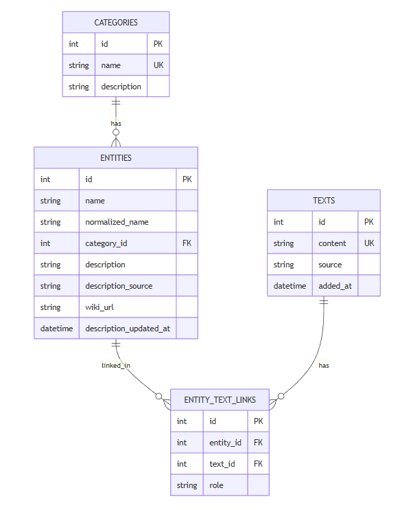

## NER‑система с базой знаний и визуализацией

Выполнили: Губаренко Анастасия, Каримова Ксения, Пархоменко Николай


### Обучение NER‑модели реализовано в ноутбуке

Итоговая модель используется при построении БД из произвольных текстов (`build_db_from_ner_texts.py`) и в Streamlit‑приложении (`app/streamlit_app.py`) для разбора текста и автодетекта категорий.

(`model_final_ner.ipynb`)[model_final_ner.ipynb] 

### Архитектура системы

Подробнее про архитектуру и внутреннюю реализацию системы (устройство БД, сервисов, визуализаций) описано в отдельном markdown‑файле в репозитории

(`SYSTEM_ARCHITECTURE.md`)[SYSTEM_ARCHITECTURE.md]



### Зависимости

- Рекомендуется Python 3.12
- Зависимости:

```bash
pip install -r requirements.txt
```

- Также использовали модель spaCy (для определения ролей сущностей - субъект / объект):

```bash
python -m spacy download en_core_web_sm
```

- И проверить, что обученная модель NER лежит в `models/my_ner_model/`

Скачать ее можно из: https://drive.google.com/drive/folders/1eVQMI0Jp3A9Yx_I02bkiu0RMD7Jphe2h?usp=sharing

### Построение базы данных

Базу можно собрать двумя основными способами:

#### Из размеченного датасета `train.csv`

```bash
python build_db_from_train.py
```

#### Из произвольных текстов с использованием обученной модели

Скрипт: `build_db_from_ner_texts.py`

Пример команды (из корня проекта):

```bash
python build_db_from_ner_texts.py ^
  --texts ner_texts_300.txt ^
  --db data/ner_kb.db ^
  --model-dir models/my_ner_model
```

Параметры:

- **`--texts`**: путь к файлу с текстами (по одному тексту на строку);
- **`--db`**: путь к выходному файлу БД;
- **`--model-dir`**: путь к директории с обученной HF‑моделью;
- **`--device`**: `-1` для CPU, `0` для `cuda:0` и т.д.;
- **`--aggregation-strategy`**: стратегия агрегации токенов (`simple`, `first`, `max`, `average` и др.).

### Запуск Streamlit‑приложения

После того как все настроено и БД построена:

```bash
streamlit run app/streamlit_app.py
```
