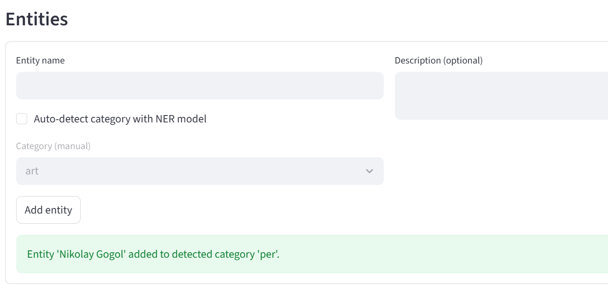
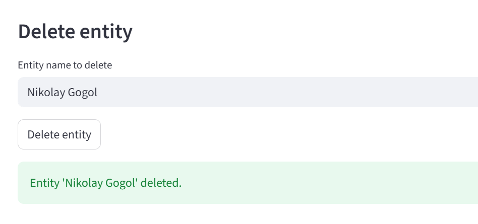
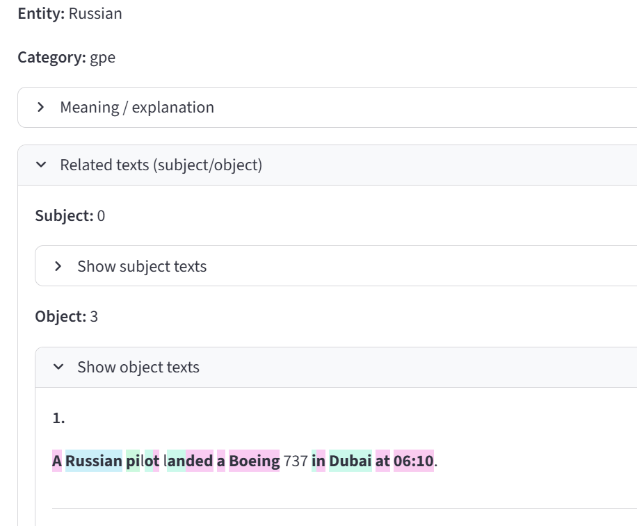
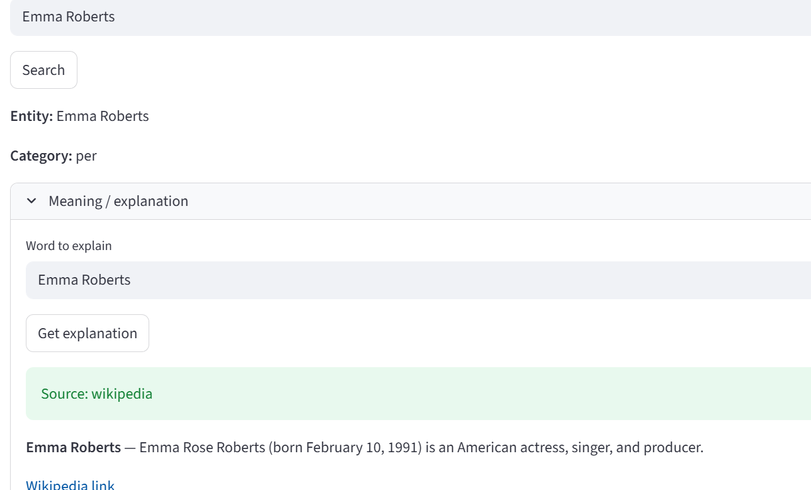
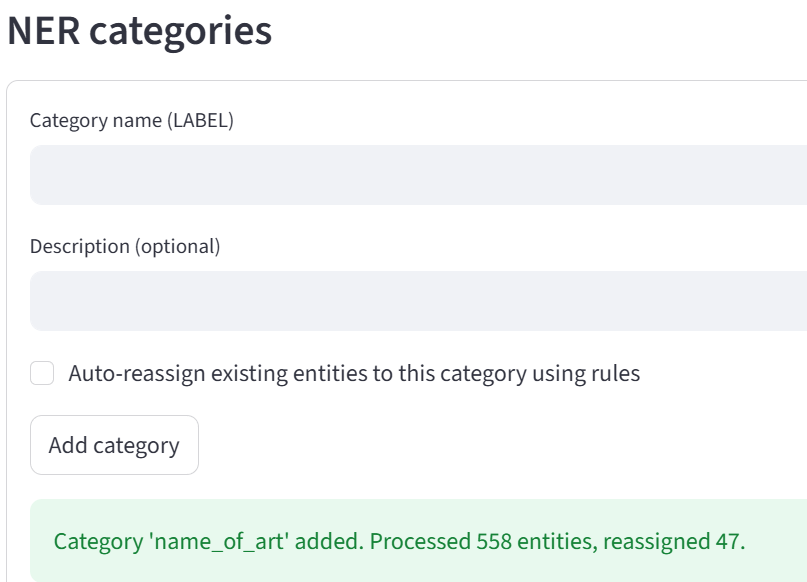
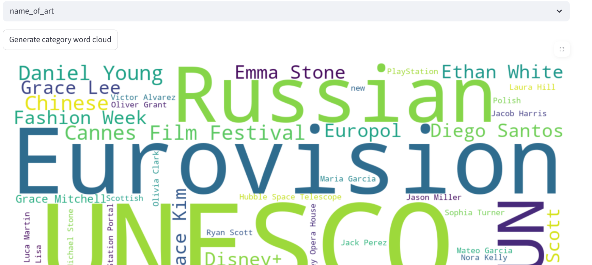
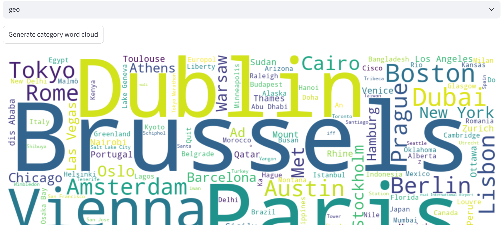
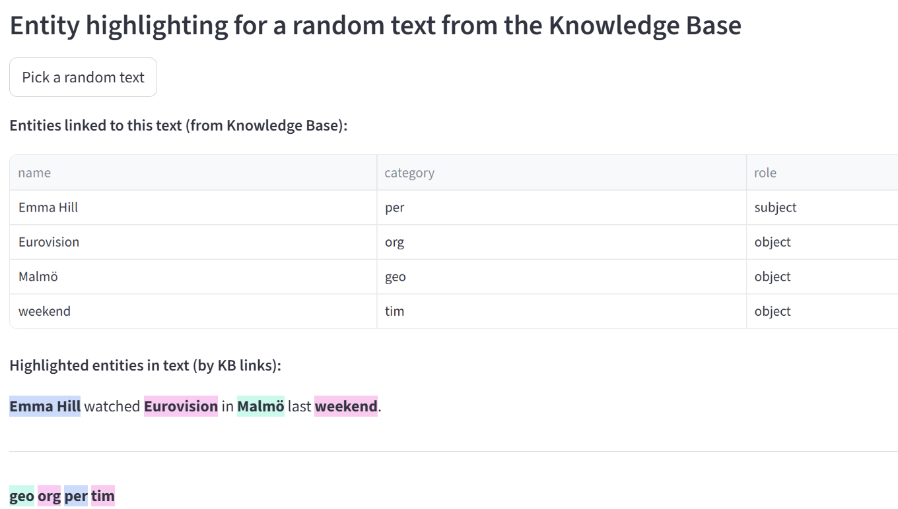

## Архитектура NER‑системы и реализация задания

### Использование модели в коде

Модель инкапсулирована в класс `HFTokenClassificationExtractor`

Он делает загружает модель и токенизатор из директории `models/my_ner_model/` и предоставляет метод `extract(text: str)`:
- на вход - сырой текст
- на выход - список распознанных сущностей

**Использование в Streamlit‑приложении**
- онлайн‑разбора введенного текста
- автодетекта категории при ручном добавлении сущности

---

### Хранение данных

- база данных `data/ner_kb.db` (SQLite)
- схема и создание таблиц `app/db/schema.py`
- обертка над SQLite (CRUD) `app/db/manager.py`

#### Сервис базы знаний: `KnowledgeBaseService` (`app/services/kb_service.py`)

Этот слой реализует высокоуровневый интерфейс и всю логику:
- добавления/удаления сущностей
- привязки сущностей к текстам
- анализа текста через модель
- определения ролей сущностей в предложении
- построения обзоров по сущностям и категориям

#### **Add/delete new entity manually**

Добавление сущности: нужно ввести слово, а выбор категории можно осуществить вручную или поставить автодетект категории моделью NER.

Удаление сущности работает чисто по имени

---

#### **Add new words from parsing input text**

Во вкладке **Dashboard** пользователь вводит произвольный текст. При нажатии **Analyze & save**: `KnowledgeBaseService` прогоняет текст через NER‑модель (`extractor.extract`), нормализует/создает категории (если включена опция auto‑create), создает новые сущности в БД, если их еще не было, сохраняет сам текст, создает связи сущностей с этим текстом

---

#### **Get texts which related to desired entity (subject / object)**

Определение ролей:

- по возможности используется **spaCy** (`en_core_web_sm`) для синтаксического разбора (subject / object)
- если модель недоступна - задействуется эвристика в `KnowledgeBaseService` (первое слово предложения - subject)

---

#### **Get explanation or meaning of word**

Для выбранной сущности (через поиск) доступен блок Meaning / explanation. Пользователь может указать слово (по умолчанию - имя сущности) и запросить объяснение

Реализация:

Метод `kb.get_explanation(term)`: запрашивает Wikipedia‑API, возвращает краткое объяснение, ссылку и источник

---

#### **Add new NER categories and auto‑update**

Во вкладке **Knowledge Base** есть блок NER categories и форма добавления новой категории. Доступна опция **Auto-reassign existing entities to this category using rules** (автоматическая переразметка сущностей по описаниям и правилам)

Архитектурно БД не ограничена фиксированным списком категорий - они создаются динамически.`KnowledgeBaseService` содержит логику:
  - `add_category(name, desc)` — добавление категории;
  - `build_category_from_local_descriptions(...)` - анализ существующих сущностей и перераспределение их в новую категорию.

---

#### Подсветки и word clouds

- **Word clouds:**

- **Подсветка сущностей:**

